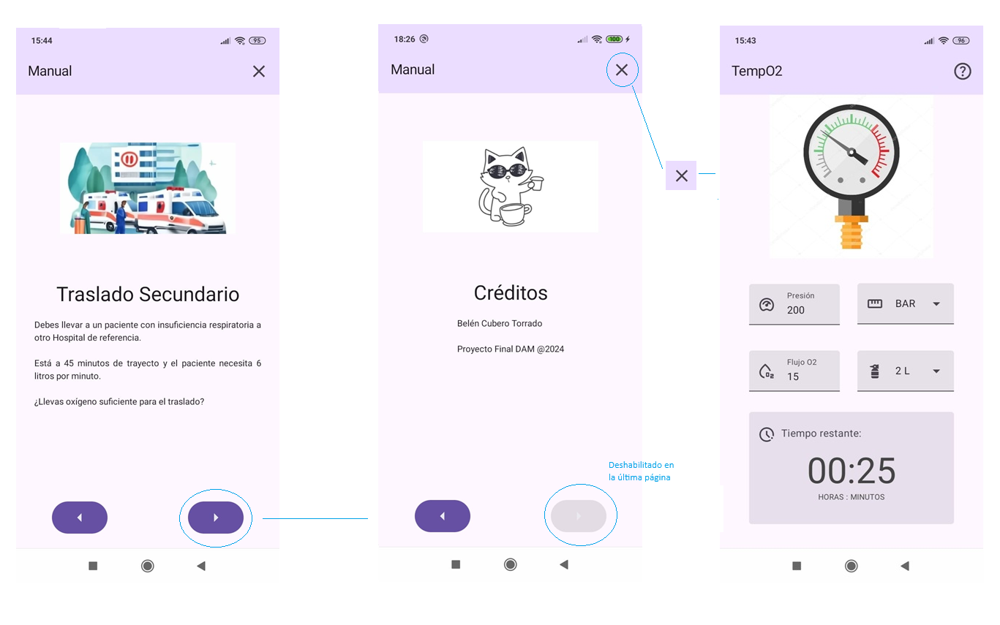
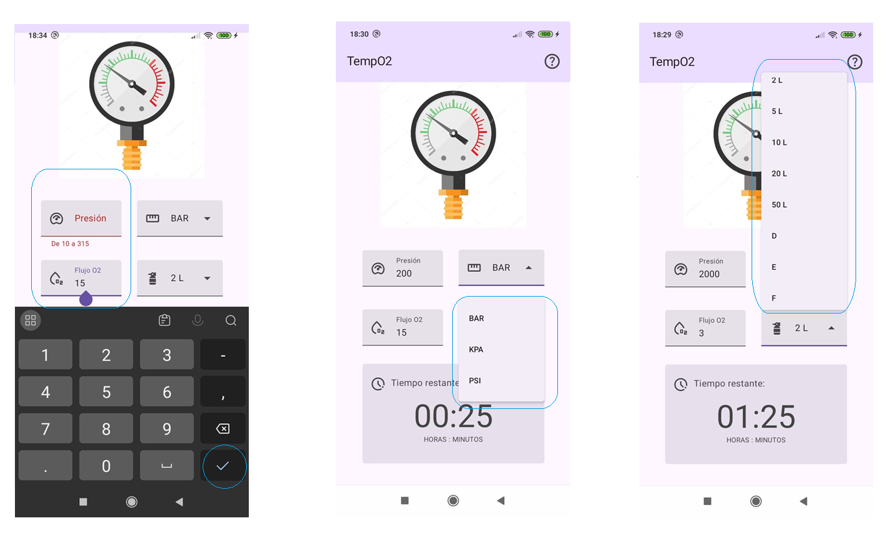

# Proyecto: TempO2
## Descripción
Este repositorio contiene el proyecto desarrollado como trabajo final del ciclo formativo FPII DAM.
El proyecto consiste en el desarrollo de una aplicación móvil en sistema operativo Android para el cálculo del tiempo restante de administración de oxígeno con botellas utilizadas en servicios de emergencias sanitarias.  
**El contenido sigue en desarrollo y puede no estar completamente optimizado o libre de errores.**

En algunos escenarios en que los profesionales sanitarios pueden contar con un inventario variado de botellas y manómetros sin un código de formato estandarizado. Además, los manómetros pueden mostrar la presión en distintas unidades de medida, lo que dificulta la estimación del oxígeno restante.
La aplicación pretende hacer posible una previsión para la variedad de unidades de medida y formatos que pueden encontrarse de forma que puedan garantizar el abastecimiento durante el transcurso de su servicio.

## Tecnologías utilizadas
- Java 8
- Kotlin
- Jetpack Compose
- JUnit
- Android Studio

## Estado del Proyecto
**Este proyecto está en constante evolución**, ya que sigo aprendiendo y mejorando mis habilidades. El código aún está en desarrollo y optimización, por lo que algunas funcionalidades pueden estar incompletas o en revisión.
- La aplicación puede ser utilizada como conversor rápido entre unidades de presión.
- Guía rápida de usuario implementada en la misma aplicación, de fácil acceso.
- Interfaz gráfica limpia, coherente y estable que entrega toda la información que el usuario necesita para utilizar la aplicación sin cambiar de pantalla.
- Texto en inglés y en español mediante internacionalización.
- Los test que comparan el resultado del cálculo de tiempo de esta aplicación con las tablas de referencia proporcionadas por proveedores de botellas de oxígeno arrojan resultados muy variados dependiendo del fabricante. Los cálculos presentan variaciones significativas según el fabricante. Al buscar un margen de error inferior al 5%, los resultados de precisión oscilan entre un 6% y un 100% de acierto. Se requiere un análisis adicional para mejorar la fiabilidad.

## Instalación y uso
De momento la aplicación se encuentra únicamente en este repositorio.

1. Clona este repositorio
2. Ábrelo en Android Studio
3. Compila y ejecuta en un emulador (desde API 24) o dispositivo físico

## Capturas de pantalla

## Mejoras previstas
- Implementar mediante canvas una imagen de manómetro cuya aguja pueda arrastrarse.
- Añadir elementos que permitan personalizar los parámetros iniciales de las botellas según fabricante.
- Aumentar los atributos de DataStoreManager para añadir configuraciónes personalizadas (modo nocturno, valores por defecto de botellas...)

## Notas
-  **Uso personal:** El código aquí compartido es principalmente para aprendizaje y experimentación.
-  **No apto para producción:** Este repositorio no está destinado a ser utilizado en un entorno de producción ni para otros proyectos sin previa revisión.
-  **No utilizar como única fuente de información para asegurar abastecimiento de material médico.** Este proyecto es un ejercicio con fin educativo para programación y no contiene todavía la información necesaria para el usuario final objetivo al que pretende dirigirse.

---
¡Gracias por visitar Temp02! Estoy en un proceso continuo de aprendizaje, así que cualquier sugerencia o comentario es bienvenido.